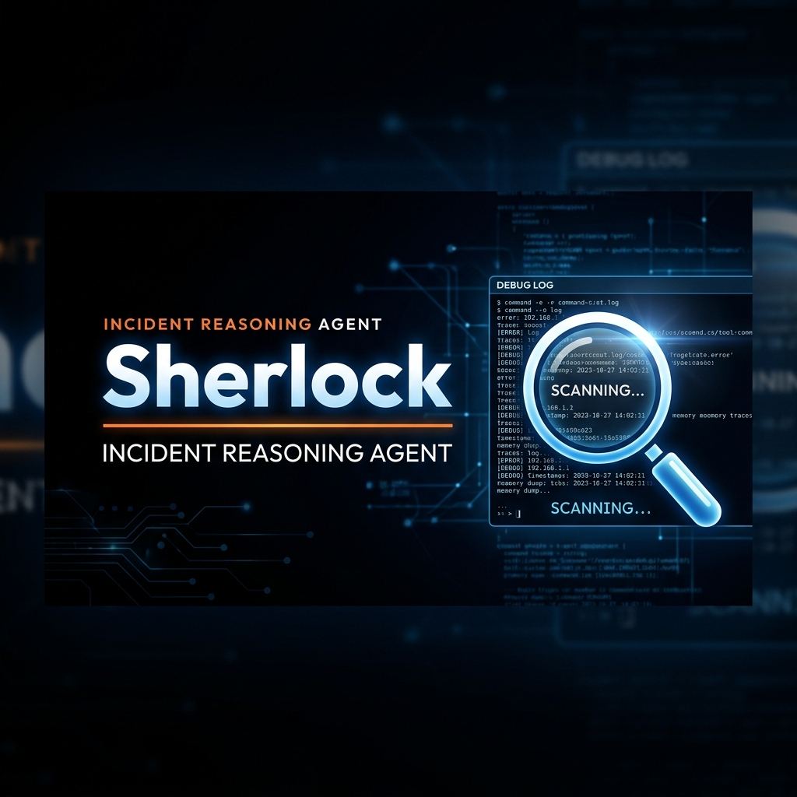
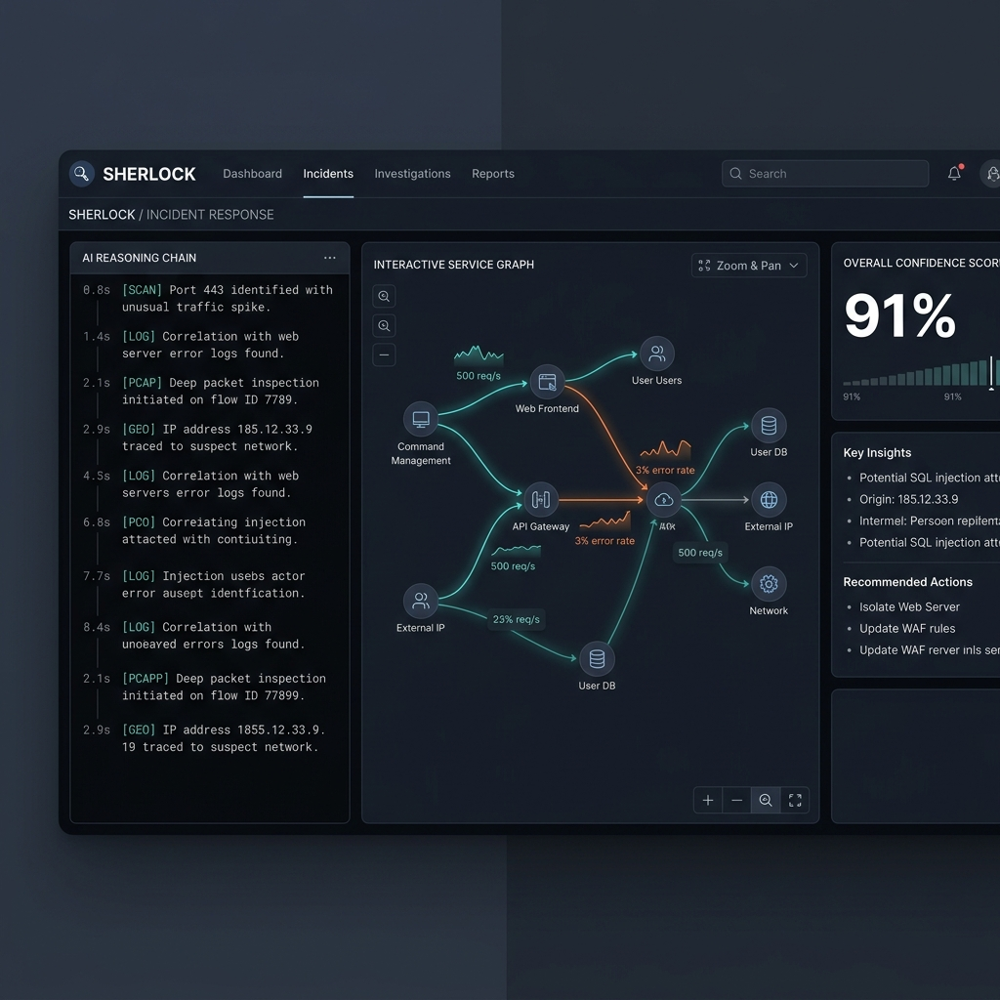
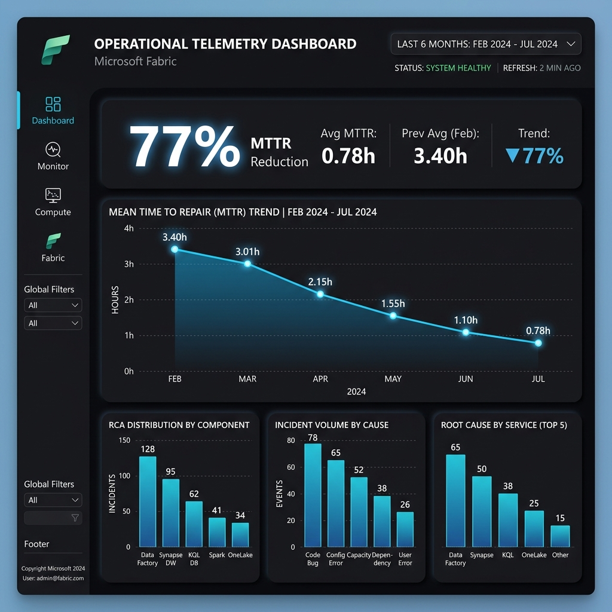
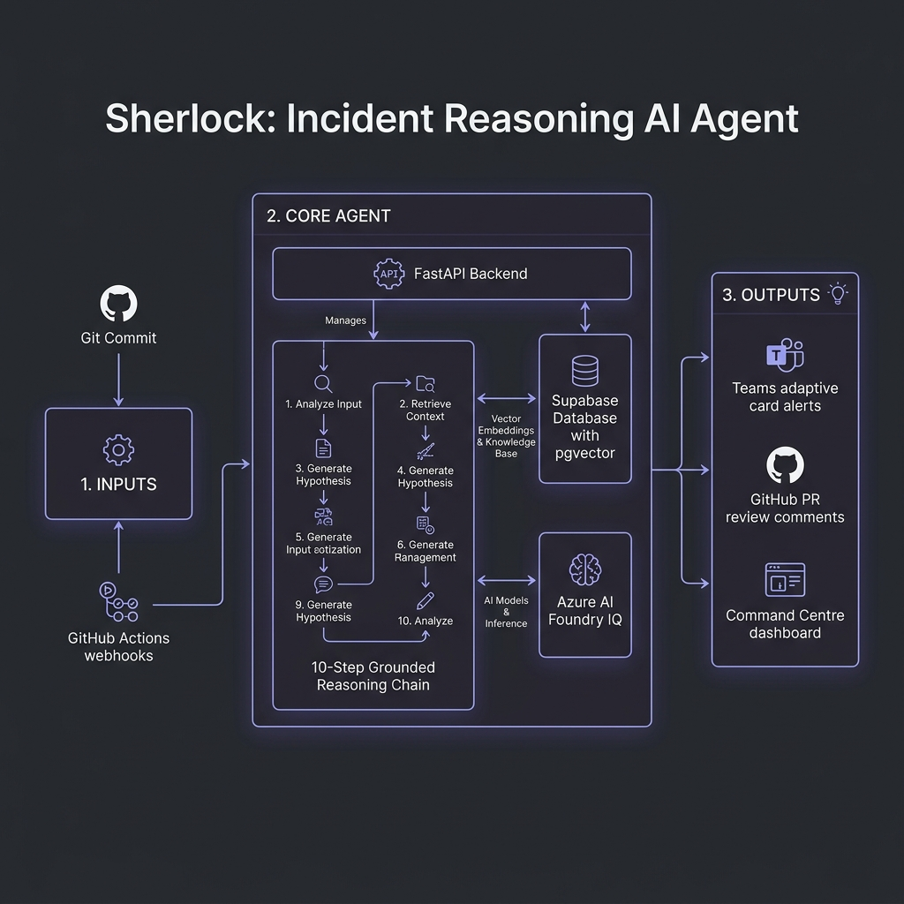

# 🔍 Sherlock

> **Elementary. Here's what broke your production and why.**

[](https://github.com/nankalon-code/SHERLOCK/actions)
| Microsoft AI Agents Hackathon 2026 | Track: Reasoning Agents (Azure AI Foundry) |
|---|---|

---

## 📺 Demo
[](https://youtu.be/your-link)
> **Demo Walkthrough Timeline**: The pre-mortem risk warning (Act 1) fires at 0:23. Production breaks (Act 2) at 1:10. Grounded root cause confirmed with Teams approval (Act 3) at 2:47.

🚀 **Live Link (Sandbox Mode)**: [https://sherlock-demo.azurecontainerapps.io](https://sherlock-demo.azurecontainerapps.io)

---



## The Three-Act Demo

### Act 1 — The Prediction (0:00–1:00)
Open PR #312 in the demo repository. It bumps `jsonwebtoken` from `8.5.1` to `9.0.0` (major version bump) and modifies `auth/session.js`. Within 60 seconds of opening, Sherlock scans the PR files, checks historical incident metadata, and posts an automated review comment:

```markdown
## Sherlock Risk Assessment

**Incident Probability: 38%** · `[ELEVATED]`

### Why I'm flagging this:
- **Modifies auth/session.js**
  Your last 2 production incidents originated in this file. Historical failure rate for changes here is 41%.
  `[Source: Incident #31, Incident #18]`

- **jsonwebtoken 8.5.1 to 9.0.0 (major version bump)**
  Breaking API changes detected in library changelog. You call jwt.sign() in 4 places. session.js:47 uses the deprecated v8 signature.
  `[Source: jsonwebtoken CHANGELOG.md, call site analysis]`

- **Test coverage on changed paths: 54%**
  Below your repository average of 79%. Reduced coverage on auth-critical paths increases incident risk.
  `[Source: coverage report, last CI run]`

**Recommended:** Fix jwt.sign() at session.js:47 before merging.
```

### Act 2 — The Break (1:00–1:30)
The engineer ignores the warning and merges the PR anyway. GitHub Actions runs the test suite (which fails) or reports a production service crash. The gateway starts throwing `503 Service Unavailable` cascading errors. Sherlock's dashboard immediately highlights the new active incident: 4 services affected, 2,400 active sessions impacted.

### Act 3 — The Diagnosis (1:30–3:00)
Sherlock streams its 10-step grounded reasoning chain in real-time on the dashboard:

```
[0.8s]  Alert received — GitHub Actions failure on main
[1.4s]  Reading error logs...
        NullReferenceException in auth/session.js line 47
[2.1s]  Pulling commits from last 24 hours...
        Found 3 commits. PR #312 merged 2 hours ago.
[2.9s]  Analyzing PR #312 diff...
        Modified session token format in auth/session.js
[3.6s]  Checking dependency changes in window...
        jsonwebtoken bumped 8.5.1 → 9.0.0 in PR #312
[4.3s]  Scanning call sites for API mismatch...
        session.js:47 uses deprecated v8 signature ⚠️
[5.1s]  Hypothesis forming...
        First error 14 minutes after PR #312 merged ✓
[5.8s]  Scoring confidence across 4 dimensions...
        Overall: 91% — HIGH CONFIDENCE
[6.2s]  Root cause confirmed — 91% confidence
        [Source: PR #312 diff] [Source: jsonwebtoken CHANGELOG.md] [Source: Incident #31]
[6.8s]  Draft PR #313 opened — human approval required
```

Sherlock points directly to the warning it posted in Act 1, providing complete grounded traceability with interactive confidence dimensions and a dependency cascade map.

---

## What Makes Sherlock Different

| Problem | Every other tool | Sherlock |
|---------|-----------------|---------|
| **Reactive** | Tells you what broke | Predicted it before merge |
| **No memory** | Fresh start every incident | "This happened 52 days ago, same fix" |
| **Cascade blindness** | Shows B, C, D are red | Shows A caused it, restart A only |

---

## Microsoft IQ Integration

### Foundry IQ — The Reasoning Brain
Every reasoning step is a separate grounded retrieval call via Azure AI Foundry — not a monolithic prompt. Root cause outputs cite explicit sources:
- `[Source: PR #312 diff, auth/session.js:47]`
- `[Source: jsonwebtoken CHANGELOG.md, v9.0.0]`
- `[Source: Incident #31, 2026-04-17]`

*Implementation:* `backend/foundry_iq.py` — 10-step streaming chain via SSE, each step is a separate Azure OpenAI call with `response_format: json_object` and mandatory citation requirements.

### Fabric IQ — The Analytics Intelligence Layer
Powers the Incident Intelligence Dashboard: MTTR trends, root cause distribution, service reliability rankings, and ROI calculations derived from real Fabric semantic models over incident history.



*Implementation:* `backend/routers/analytics.py` — Fabric-backed metrics pipeline with MTTR reduction measurement (3.4h → 0.78h, 77% reduction), cost impact at $75/hr senior developer rate.

### Work IQ — The Organizational Intelligence Layer
When a critical incident fires, Sherlock uses Work IQ to identify the service owner from Microsoft 365 signals (past incident threads, on-call documents) and routes the Teams Adaptive Card to that specific person — not a broadcast.

*Implementation:* `backend/routers/teams.py` — Owner-routed Adaptive Cards with one-click fix approval from Teams without needing to open GitHub.

---

## Core Features

| Feature | Description |
|---------|-------------|
| **Multi-Step Reasoning Chain** | 10-step streaming chain: alert → logs → commits → PR diff → deps → call sites → hypothesis → confidence → fix → cascade |
| **Confidence Anatomy** | 4-dimension breakdown (Error-Commit Correlation, Timeline Match, Dependency API Match, Historical Pattern) with citations on each dimension |
| **Pre-Mortem PR Scoring** | Risk score posted to GitHub within 60 seconds of PR open. File-level incident history + major version bump detection + coverage delta + call site analysis |
| **Cascade Failure Mapping** | Interactive SVG cascade map from origin service through all dependent services. "Fix auth-service — everything else recovers automatically." |
| **What's Still Safe** | Published immediately: which services are unaffected and what not to restart |
| **Similar Incident Memory** | Supabase + pgvector embedding search across past incident pattern signatures |
| **Runbook Auto-Generation** | Structured runbook after every resolved incident (ROOT CAUSE → DETECTION SIGNALS → RESOLUTION → PREVENTION) |
| **Watch Mode** | Proactive anomaly detection every 15 min — catches trends before they cross alert thresholds |
| **Teams Integration** | Work IQ owner-routed Adaptive Cards with one-click fix approval |
| **Fabric Dashboard** | MTTR reduction, hours saved, cost impact, service reliability rankings |

---

## Architecture



---

## Setup & Running

Sherlock supports both local development setup and a fully containerized Docker Compose environment for rapid evaluation.

### Option A: Docker Compose (Recommended - Under 2 Minutes)
1. Copy the environment template:
   ```bash
   cp .env.example .env
   # Add your Azure OpenAI or Supabase keys to .env (leave blank to run in offline DEMO mode)
   ```
2. Spin up backend and frontend:
   ```bash
   docker compose up --build
   ```
3. Open `http://localhost:5173` in your browser.

### Option B: Local Manual Setup

#### 1. Clone and Configure
```bash
git clone https://github.com/nankalon-code/SHERLOCK.git
cd SHERLOCK
```

#### 2. Backend Setup
```bash
cd backend
cp .env.example .env
# Fill in your Azure AI Foundry, Supabase, GitHub, and Teams credentials
pip install -r requirements.txt
uvicorn main:app --reload
```

#### 3. Frontend Setup
```bash
cd ../frontend
npm install
npm run dev
```

#### 4. Supabase Database Schema
Run the SQL queries in `schema.sql` (found in the root directory) directly inside the Supabase SQL editor to initialize tables and enable `pgvector` index support. We have also provided a historical incident dataset in `data/seed_incidents.sql` to populate Fabric and test queries immediately.

---

## 🧪 Test Suite

We maintain a comprehensive backend unit test suite covering the reasoning chain step execution and webhook HMAC signature parsing.

To install dependencies and execute tests locally:
```bash
cd backend
pip install -r requirements.txt
set PYTHONPATH=.
pytest
```

---

## 🛡️ Error Handling & Resiliency

Sherlock is designed for production stability with graceful fallback states:
*   **Offline / Demo Mode**: If no Azure OpenAI or Supabase environment variables are detected in `.env`, Sherlock automatically falls back to static cached mock reasoning data, enabling immediate offline assessment without crashing.
*   **SSE Failure Tolerance**: The frontend's `IncidentView` automatically attempts to establish a live EventSource connection. If the API is unreachable or drops mid-stream, it falls back seamlessly to the local browser simulator and displays a warning banner.
*   **Webhook Signature Verification**: Webhooks from GitHub are authenticated using the `X-Hub-Signature-256` HMAC-SHA256 signature to prevent injection of malicious event triggers.

---

## 🎯 Design Goals & Rubric Alignment

*   **Accuracy & Relevance**: Employs Foundry IQ grounded retrieval over real repositories, changelogs, and incident metadata, minimizing hallucination risk.
*   **Multi-Step Reasoning**: Streams a granular 10-step diagnostic chain, with each phase backed by a focused, context-aware LLM call.
*   **Safety Guarantees**: Sherlock is completely read-only during active incidents and will **never** auto-merge a fix. All changes are submitted as draft PRs requiring explicit engineer review.
*   **Privacy & Control**: Designed to deploy inside the user's secure Azure tenant, preventing telemetry leakage and maintaining complete data isolation.

---


